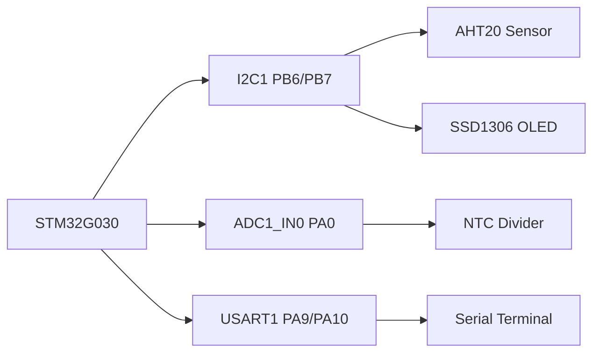
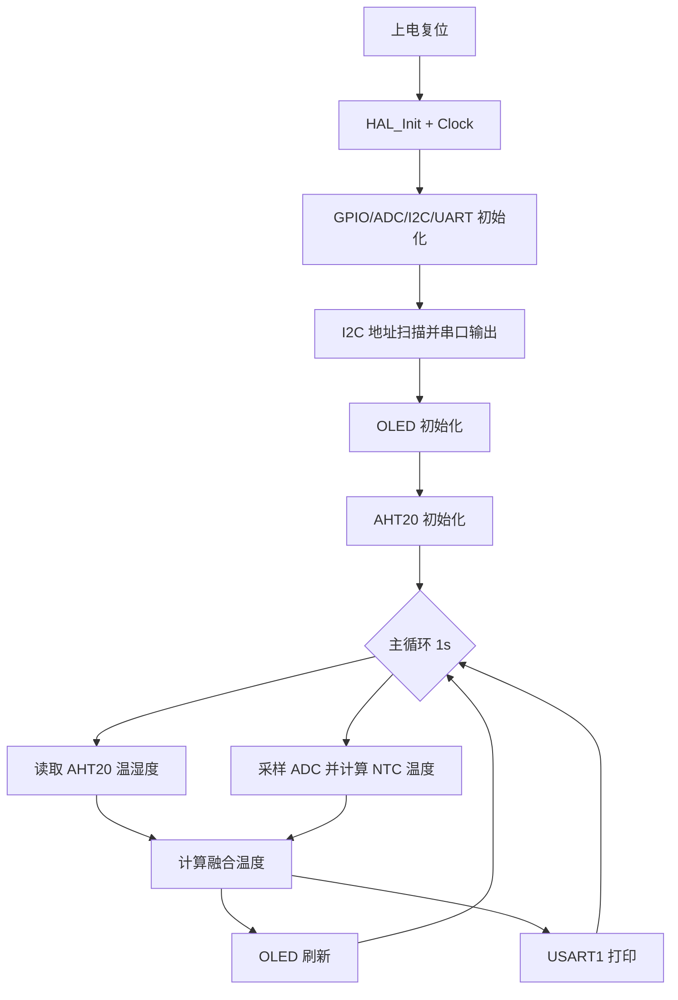

# 基于 STM32G030 的多源环境温度测量与 OLED 可视化系统

> 项目类型：嵌入式硬件实验 / 课程设计  
> 平台：STM32G030F6Px + HAL  
> 作者：`sea90d`

---

## 摘要

本项目实现了一个环境参数采集与显示系统：通过 I2C1 采集 AHT20 温湿度数据，通过 ADC1_IN0 读取 NTC 热敏电阻分压并进行温度反演，随后将两路温度进行融合估计，在 SSD1306 OLED 上实时显示，同时经 USART1 输出到串口终端。系统还在启动阶段增加 I2C 地址扫描，用于快速定位外设地址并辅助硬件排错。

---

## 1. 硬件设计

### 1.1 外设连接

| 模块 | 接口 | 引脚 | 说明 |
|---|---|---|---|
| AHT20 | I2C1 | PB6(SCL), PB7(SDA) | 温湿度采集，常见地址 `0x38`(7-bit) |
| SSD1306 OLED | I2C1 | PB6(SCL), PB7(SDA) | 显示模块，常见地址 `0x3C/0x3D`(7-bit) |
| NTC 分压 | ADC1_IN0 | PA0 | 采样电压并换算温度 |
| 串口终端 | USART1 | PA9(TX), PA10(RX) | 波特率 115200 |

### 1.2 系统框图



---

## 2. 软件流程



---

## 3. 关键方法与数学模型

### 3.1 AHT20 数据换算

设原始 20-bit 湿度值记为 `S_RH`，温度值记为 `S_T`，则：

```math
RH = \frac{S_{RH}}{2^{20}} \times 100
```

```math
T_{AHT20}(^\circ C)=\frac{S_T}{2^{20}} \times 200 - 50
```

其中 `2^20 = 1048576`，因此也可写为：

```math
RH = \frac{S_{RH}}{1048576} \times 100
```

```math
T_{AHT20}(^\circ C)=\frac{S_T}{1048576} \times 200 - 50
```

符号说明：`RH` 表示相对湿度（Relative Humidity），`T_AHT20` 表示 AHT20 计算温度。

### 3.2 NTC 温度计算（Steinhart-Hart）

由分压关系（上拉电阻 $R_{ref}=10k\Omega$）：

$$
R_{NTC}=\frac{(V_{ref}-V_{adc})\cdot R_{ref}}{V_{adc}}
$$

随后使用 Steinhart-Hart 形式：

$$
\frac{1}{T(K)}=A+B\ln\left(\frac{R_{NTC}}{R_0}\right)+C\left[\ln\left(\frac{R_{NTC}}{R_0}\right)\right]^3
$$

本项目参数：

- $A=0.001129148$
- $B=0.000234125$
- $C=0.0000000876741$
- $R_0=10k\Omega$

最终摄氏温度：

$$
T_{NTC}(^\circ C)=T(K)-273.15
$$

### 3.3 多源温度融合

当前采用等权平均：

$$
T_{avg}=\frac{T_{AHT20}+T_{NTC}}{2}
$$

当 AHT20 读取失败时，系统退化为 NTC 单路温度输出。

---

## 4. 代码实现映射

| 功能 | 主要函数 | 文件 |
|---|---|---|
| I2C 扫描 | `I2C1_ScanDevices()` | `Core/Src/main.c` |
| AHT20 初始化与读取 | `AHT20_Init()` `AHT20_Read()` | `Core/Src/main.c` |
| ADC 读取与 NTC 计算 | `Read_ADC_Voltage()` `Calculate_NTC_Temperature()` | `Core/Src/main.c` |
| 显示与串口输出 | `OLED_ShowEnvData()` `UART_PrintEnvData()` | `Core/Src/main.c` |
| OLED 驱动（I2C1） | `OLED_Send()` | `Core/Src/oled.c` |
| 串口引脚配置 | USART1 MSP | `Core/Src/stm32g0xx_hal_msp.c` |

---

## 5. 串口输出示例

### 5.1 I2C 扫描输出

```text
[I2C1] Scan start...
[I2C1] Found: 7-bit 0x38, 8-bit W 0x70
[I2C1] Found: 7-bit 0x3C, 8-bit W 0x78
[I2C1] Scan done, total 2 device(s).
```

### 5.2 运行时输出

```text
AHT20 T=26.41 C, H=52.83 %RH | NTC T=26.09 C | AVG T=26.25 C
```

---

## 6. 编译与下载

1. 打开 `MDK-ARM/Desktop.uvprojx`
2. 选择 Target: `Desktop`
3. Build 工程
4. 烧录后打开串口终端（115200, 8N1）观察输出

---

## 7. 误差分析

1. 传感器固有误差（AHT20 与 NTC 曲线拟合误差）
2. ADC 参考电压波动导致 $V_{adc}$ 偏移
3. 分压电阻精度影响 $R_{NTC}$ 计算
4. NTC 自热与板上热源耦合
5. 当前融合为等权平均，未做动态置信度估计

---

## 8. 参考资料

1. AHT20 Datasheet  
2. SSD1306 Datasheet  
3. STM32G0 HAL Documentation  
4. Steinhart, J. S., & Hart, S. R. (1968). Calibration curves for thermistors
