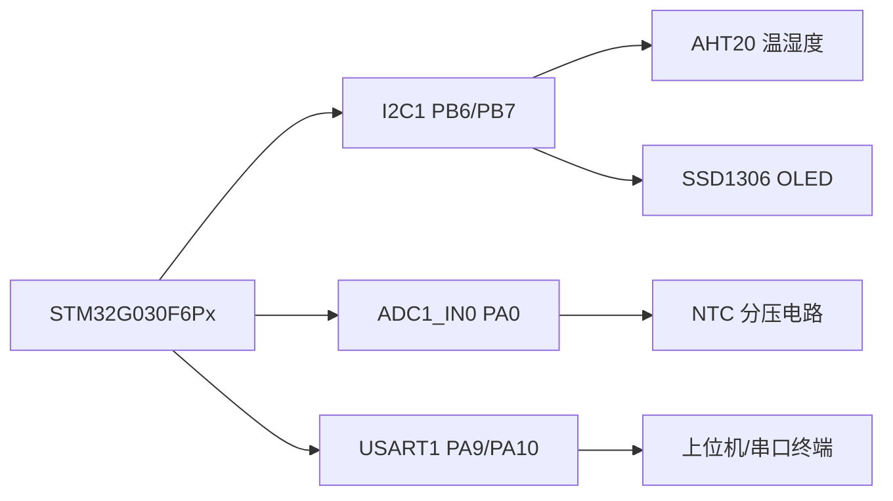
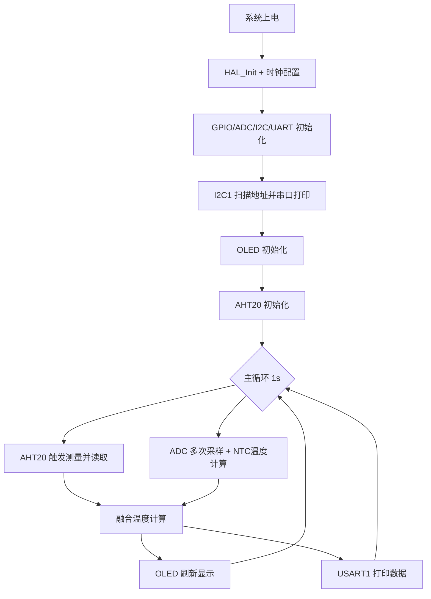

# 基于 STM32G030 的多源环境温度测量与 OLED 可视化系统

> 课程/培训项目：I2C 温湿度采集 + ADC 热敏电阻测温 + SSD1306 显示 + 串口上位机输出  
> MCU：STM32G030F6Px（HAL 驱动）  
> Author: `sea90d`

---

## 摘要

本文设计并实现了一个嵌入式环境参数采集系统，采用 **AHT20 数字温湿度传感器** 与 **NTC 热敏电阻模拟测温通道** 两路温度信息进行融合估计，输出环境温度与湿度。系统基于 STM32G030 平台，使用 I2C1 总线驱动 AHT20 与 SSD1306 OLED，使用 ADC1_IN0 采集分压电路电压并通过 Steinhart-Hart 方程计算热敏电阻温度，最终在 OLED 实时显示，并通过 USART1（PA9/PA10）向外发送串口数据。  
为提高可调试性，系统在启动阶段加入 I2C 地址扫描机制，自动报告总线在线设备地址。项目实现了从硬件接口定义、驱动移植、数据处理到可视化输出的完整闭环。

**关键词**：STM32G030；AHT20；SSD1306；NTC；Steinhart-Hart；I2C 扫描；多源温度融合

---

## 1. 系统总体设计

### 1.1 硬件连接

| 外设 | MCU接口 | 引脚 | 说明 |
|---|---|---|---|
| AHT20 温湿度传感器 | I2C1 | PB6(SCL), PB7(SDA) | 地址通常为 `0x38`（7-bit） |
| SSD1306 OLED | I2C1 | PB6(SCL), PB7(SDA) | 地址通常为 `0x3C/0x3D`（7-bit） |
| NTC 热敏电阻分压 | ADC1_IN0 | PA0 | 读取分压并换算温度 |
| 串口输出 | USART1 | PA9(TX), PA10(RX) | 115200 bps |

### 1.2 硬件架构图（Figure 1）



---

## 2. 软件架构与工作流

### 2.1 软件流程图（Figure 2）



### 2.2 代码模块映射

| 模块 | 主要函数 | 文件 |
|---|---|---|
| I2C 地址扫描 | `I2C1_ScanDevices()` | `Core/Src/main.c` |
| AHT20 驱动 | `AHT20_Init()` `AHT20_Read()` | `Core/Src/main.c` |
| ADC/NTC 测温 | `Read_ADC_Voltage()` `Calculate_NTC_Temperature()` `Read_NTC_Temperature()` | `Core/Src/main.c` |
| 温度融合与输出 | `OLED_ShowEnvData()` `UART_PrintEnvData()` | `Core/Src/main.c` |
| OLED 驱动移植 | `OLED_Send()`（绑定 `hi2c1`） | `Core/Src/oled.c` |
| 串口引脚与时钟 | USART1 MSP 配置 | `Core/Src/stm32g0xx_hal_msp.c` |

---

## 3. 关键方法与数学模型

### 3.1 AHT20 数据换算

设原始 20-bit 湿度值为 \(S_{RH}\)，温度值为 \(S_T\)，则：

\[
RH(\%) = \frac{S_{RH}}{2^{20}} \times 100
\]

\[
T_{AHT20}(^\circ C)=\frac{S_{T}}{2^{20}} \times 200 - 50
\]

### 3.2 NTC 温度计算（Steinhart-Hart）

由分压关系（上拉电阻 \(R_{ref}=10k\Omega\)）：

\[
R_{NTC} = \frac{(V_{ref}-V_{adc})\cdot R_{ref}}{V_{adc}}
\]

随后使用 Steinhart-Hart 形式：

\[
\frac{1}{T(K)} = A + B\ln\left(\frac{R_{NTC}}{R_0}\right) + C\left[\ln\left(\frac{R_{NTC}}{R_0}\right)\right]^3
\]

本项目常数：
- \(A=0.001129148\)
- \(B=0.000234125\)
- \(C=0.0000000876741\)
- \(R_0=10k\Omega\)

最后：

\[
T_{NTC}(^\circ C)=T(K)-273.15
\]

### 3.3 多源温度融合

当前实现采用等权平均：

\[
T_{avg}=\frac{T_{AHT20}+T_{NTC}}{2}
\]

当 AHT20 读数异常时，退化为 NTC 单路输出。

---

## 4. 工程实现步骤（与本项目开发过程一致）

1. 基于 CubeMX 生成 STM32G030 HAL 工程骨架（ADC/I2C/UART/GPIO）。
2. 将 SSD1306 驱动（`oled.c/.h`、`font.c/.h`）迁移到 `Core` 目录并加入 Keil 工程。
3. 修正 OLED 底层发送接口：将 I2C 句柄绑定到 `hi2c1`。
4. 编写 AHT20 初始化与测量流程（软复位、状态检查、busy 轮询）。
5. 编写 ADC 采样 + NTC 温度换算函数，并采用多次采样平均抑制噪声。
6. 实现 OLED 四行显示：`T_AHT20`、`T_NTC`、`T_AVG`、`HUM`。
7. 实现 USART1 文本输出，便于上位机记录与调试。
8. 增加 `I2C1_ScanDevices()` 启动扫描，自动定位从机地址。
9. 修正串口配置为板级实际连接：`USART1 PA9/PA10`。

---

## 5. 启动扫描与典型输出

### 5.1 I2C 扫描输出（串口）

```text
[I2C1] Scan start...
[I2C1] Found: 7-bit 0x38, 8-bit W 0x70
[I2C1] Found: 7-bit 0x3C, 8-bit W 0x78
[I2C1] Scan done, total 2 device(s).
```

> 注：SSD1306 常见 7-bit 地址为 `0x3C`（对应 8-bit 写地址 `0x78`），也可能为 `0x3D`（`0x7A`）。

### 5.2 主循环输出（串口）

```text
AHT20 T=26.41 C, H=52.83 %RH | NTC T=26.09 C | AVG T=26.25 C
```

---

## 6. 工程目录（核心）

```text
tutorial/
├─ Core/
│  ├─ Inc/
│  │  ├─ main.h
│  │  ├─ oled.h
│  │  └─ font.h
│  └─ Src/
│     ├─ main.c
│     ├─ oled.c
│     ├─ font.c
│     └─ stm32g0xx_hal_msp.c
├─ Drivers/
└─ MDK-ARM/
   └─ Desktop.uvprojx
```

---

## 7. 编译与下载

### 7.1 Keil MDK

1. 打开 `MDK-ARM/Desktop.uvprojx`
2. 选择目标 `Desktop`
3. Build
4. 下载到板卡并打开串口终端（115200, 8N1）

### 7.2 串口参数

- 波特率：`115200`
- 数据位：`8`
- 停止位：`1`
- 校验位：`None`

---

## 8. 误差来源与讨论

1. **传感器固有误差**：AHT20 与 NTC 均有标定误差与温漂。
2. **电源与 ADC 参考波动**：`Vref` 假设为 3.3V，实际波动会引入 NTC 温度偏差。
3. **分压电阻精度**：`10kΩ` 电阻容差直接影响 `R_NTC` 估计精度。
4. **自热效应与布局**：NTC 贴近发热器件会产生系统偏差。
5. **融合策略简单**：等权平均未利用动态置信度，后续可使用加权融合或卡尔曼滤波。

---

## 9. 可复现性建议

为复现实验结果，建议固定以下条件：

- 环境温度稳定，避免强对流与直吹。
- 板卡 3.3V 供电稳定。
- NTC 参考电阻使用 1% 或更高精度器件。
- OLED 与 AHT20 共线 I2C 拉电阻匹配（常见 4.7kΩ）。
- 每次改动后记录串口日志并保留版本号（Git commit hash）。

---

## 10. 后续改进方向

- 融合算法升级：基于方差估计的自适应加权。
- 数据记录：引入环形缓存或外部存储用于长期统计。
- 校准机制：增加两点标定（低温/常温）补偿参数。
- UI 改进：OLED 增加趋势曲线和状态图标。

---

## 参考资料

1. Aosong, *AHT20 Datasheet*  
2. Solomon Systech, *SSD1306 Datasheet*  
3. STMicroelectronics, *STM32G0 HAL User Manual*  
4. Steinhart, J. S., & Hart, S. R. (1968). Calibration curves for thermistors.

---

## 许可

本仓库用于学习与实验，默认遵循原厂 HAL 与第三方驱动各自许可条款。

